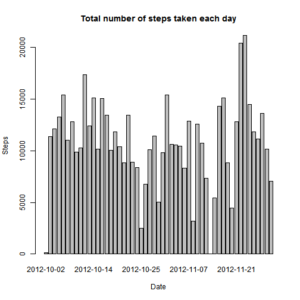
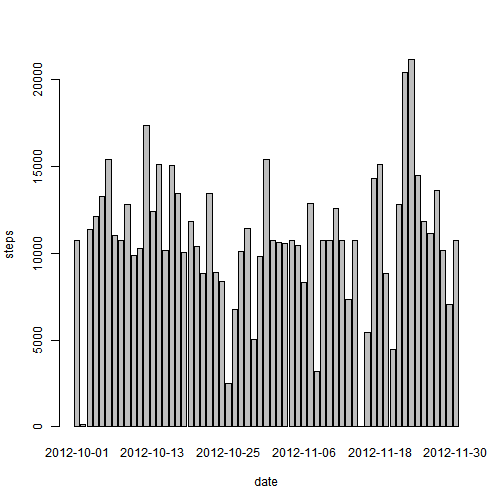
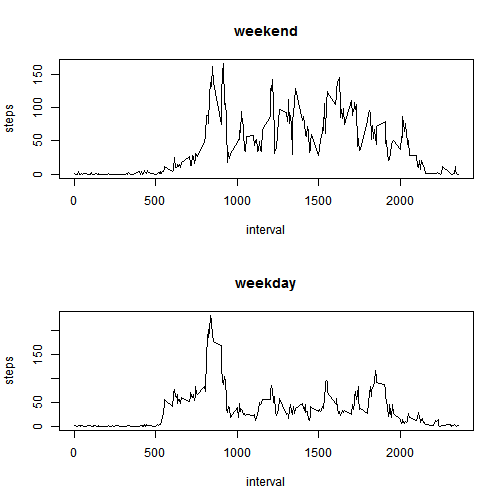

# Reproducible Research: Peer Assessment 1
This Rmarkdown file is developed for Coursera class **Reproducible Research**.  
Authored by: Dhaval Patel  

Code Location on github: *https://github.com/dhaval1406/RepData_PeerAssessment1*

## Loading and preprocessing the data


```r
require(data.table)
```

```
## Loading required package: data.table
```

```r
# Setting working directory. You may need to change this if you would like
# to run the code
setwd("P:/ImpDocuments/Reproducible_Research_Coursera_052014/Assignments/RepData_PeerAssessment1/")

# Reading file dirctly from zip folder
data.csv <- unzip("activity.zip", exdir = tempdir())
data <- fread(data.csv)
# Formating date field to Date
data[, `:=`(date, as.Date(date))]
```


## What is mean total number of steps taken per day?

1. Make a histogram of the total number of steps taken each day


```r
# Aggregate steps data by date and total them
tot.sum.per.day <- aggregate(steps ~ date, data = data, FUN = sum)

# Plot barplot, since it gives better view per date compare to histogram
barplot(tot.sum.per.day$steps, names.arg = tot.sum.per.day$date, xlab = "Date", 
    ylab = "Steps", main = "Total number of steps taken each day")
```

 


2. Calculate and report the mean and median total number of steps taken per day


```r
steps_mean <- mean(data$steps, na.rm = T)
steps_median <- median(data$steps, na.rm = T)
```


The **mean** and **median** for total number of steps taken per day are **37.3826** and **0**.


## What is the average daily activity pattern?

1. Make a time series plot (i.e. type = "l") of the 5-minute interval (x-axis) and the average number of steps taken, averaged across all days (y-axis)


```r
aggre.steps.interval <- as.data.table(aggregate(steps ~ interval, data = data, 
    FUN = mean))

with(aggre.steps.interval, plot(interval, steps, type = "l"))
```

 


2. Which 5-minute interval, on average across all the days in the dataset, contains the maximum number of steps?


```r
int.max.steps <- aggre.steps.interval$interval[which.max(aggre.steps.interval$steps)]
```


## Imputing missing values

1. Calculate and report the total number of missing values in the dataset (i.e. the total number of rows with NAs)


```r
sum(!complete.cases(data))
```

```
## [1] 2304
```


2. Devise a strategy for filling in all of the missing values in the dataset. The strategy does not need to be sophisticated. For example, you could use the mean/median for that day, or the mean for that 5-minute interval, etc.

I and going to use the means of intervals, calculated above, to impute missing values
  
3. Create a new dataset that is equal to the original dataset but with the missing data filled in.


```r
# Merge data by interval
merged.data <- merge(data, aggre.steps.interval, by = "interval")

# Get row numbers with blank value
nas <- which(is.na(merged.data$steps.x) == "TRUE")

# Fill blanks with pre-calculated means
merged.data$steps.x[nas] <- merged.data$steps.y[nas]

# Get rid off extra column and reformat column names
merged.data$steps.y <- NULL
setnames(merged.data, "steps.x", "steps")
```


4. Make a histogram of the total number of steps taken each day and Calculate and report the mean and median total number of steps taken per day. Do these values differ from the estimates from the first part of the assignment? What is the impact of imputing missing data on the estimates of the total daily number of steps?


```r
tot.steps.by.date <- aggregate(steps ~ date, data = merged.data, FUN = sum)

barplot(tot.steps.by.date$steps, names.arg = tot.steps.by.date$date, xlab = "date", 
    ylab = "steps")
```

 


## Are there differences in activity patterns between weekdays and weekends?

1. Create a new factor variable in the dataset with two levels - "weekday" and "weekend" indicating whether a given date is a weekday or weekend day.


```r
merged.data$day_type <- as.factor(ifelse(weekdays(merged.data$date) %in% c("Saturday", 
    "Sunday"), "weekend", "weekday"))
```


2. Make a panel plot containing a time series plot (i.e. type = "l") of the 5-minute interval (x-axis) and the average number of steps taken, averaged across all weekday days or weekend days (y-axis). 


```r
# 2 plots in the same window
par(mfrow = c(2, 1))

# Plotting averaged steps by interval across weekday and weekend
plots <- sapply(c("weekend", "weekday"), function(type) {
    # Aggregate data by interval and average steps
    steps.int.daytype <- aggregate(steps ~ interval, data = merged.data, subset = merged.data$day_type == 
        type, FUN = mean)
    # Plotting line chart
    with(steps.int.daytype, plot(interval, steps, type = "l", main = type))
})
```

 


